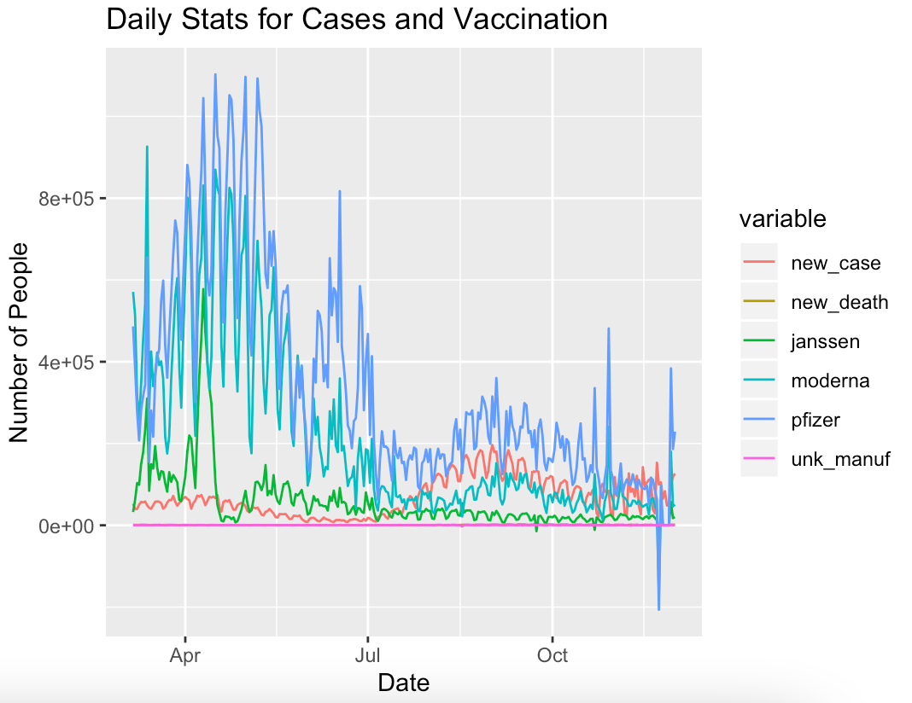
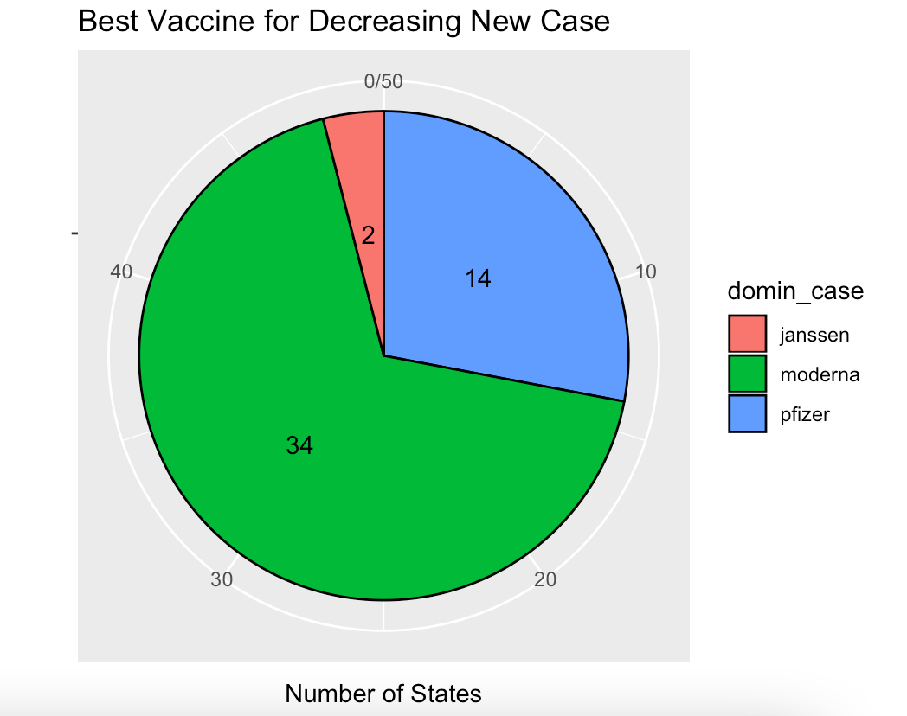
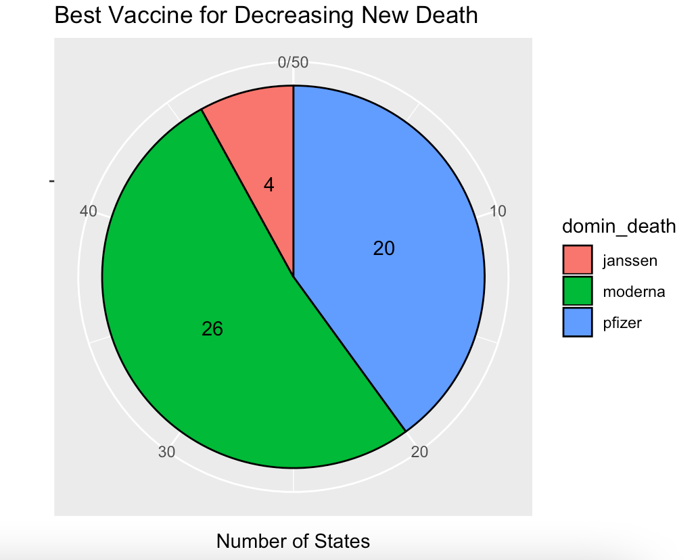
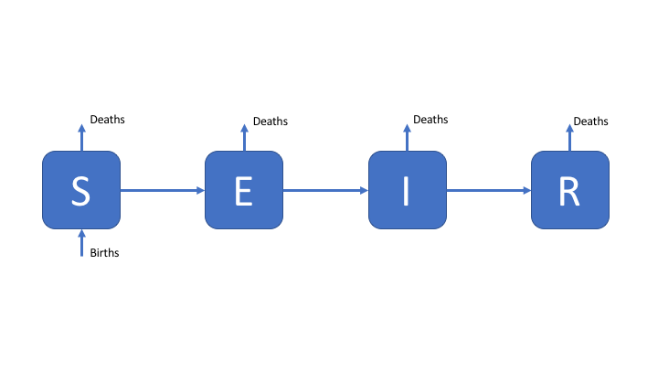
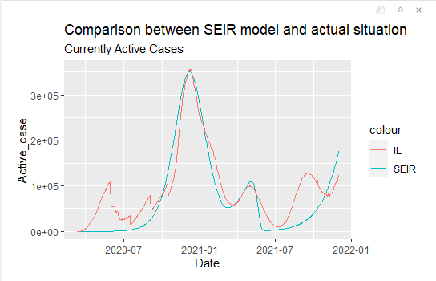

```{r setup, include=FALSE}
knitr::opts_chunk$set(echo = TRUE)
# https://bookdown.org/yihui/rmarkdown/ioslides-presentation.html
```

## Introduction  
  
#### Topics  
  
- Covid-19 vaccination rate vs. daily cases 
- Performance of three major vaccine companies  
- Virus spread model  

#### Datasets  
  
- CDC COVID-19 Vaccination in the United States  
  - 23.3k+ rows and 80 columns  
  - variables include Date, Location, Series_Complete_Yes...
  
- United States COVID-19 Cases and Deaths by State over Time  
  - 41.2k+ rows and 15 columns  
  - variables include submission_date, state, new_case, new death...

## Analysis | Vaccination rate with daily cases

- Turn off alarm
- Get out of bed

## Analysis | Comparison of three major vaccine brands

- Overall trend in the US  
  
{width=30%}
  
- Performance of vaccines from Pfizer, Moderna, and Janssen  
  
{width=28%}
{width=28%}

## Analysis | SEIR model  
  
- Introduce the model  
  
{width=25%}
  
- Applying the model to data from Illinois  

{width=40%}

# Conclusion


